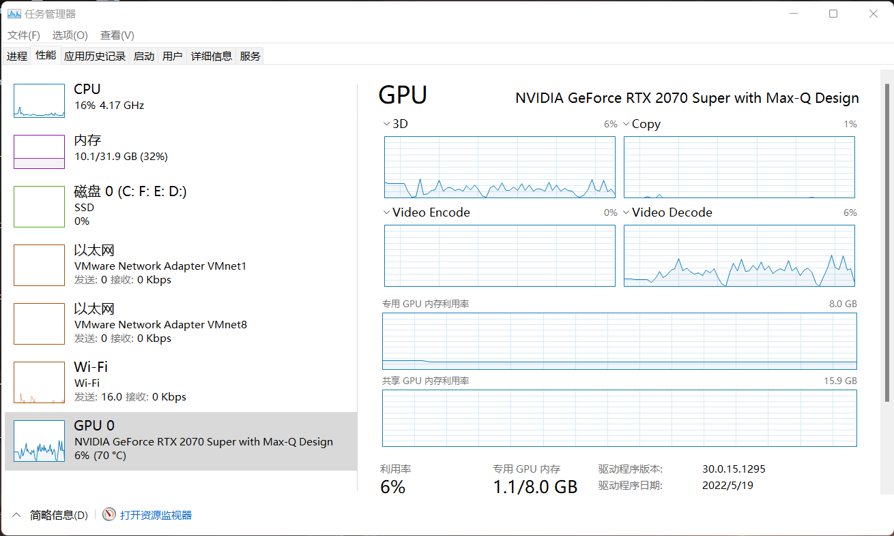
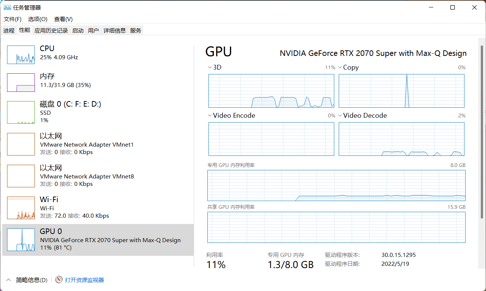
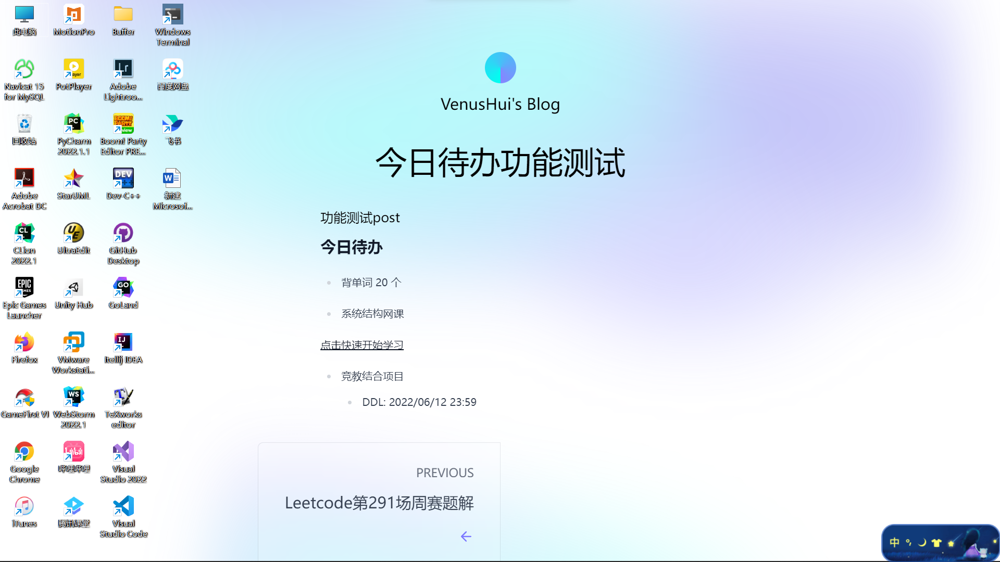
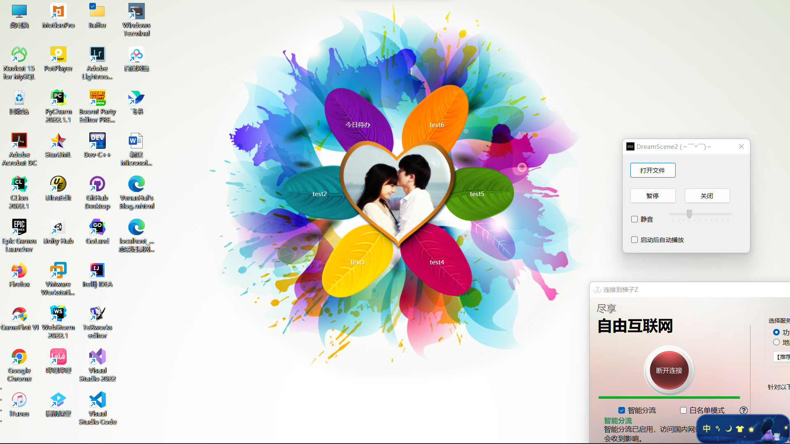

## 项目介绍

### 项目地址

[https://github.com/VenusHui/Desktop_Assistant_Pro](https://github.com/VenusHui/Desktop_Assistant_Pro)

### 项目动机

对于每一个电脑用户而言，桌面壁纸一定是一个绕不开的话题，但应用目前主流操作系统的PC产品对于桌面壁纸这方面的设计还是香港队死板，客制化程度较低，无法满足一些对于自己电脑桌面壁纸有着更高要求的用户，而本团队便是以此为出发点，开发了这样一款高自由度的轻量级桌面壁纸软件，来更好的满足这一细分群体的需求。

### 竞品分析

#### 1.Windows系统桌面个性化工具

**Strengths**

相较于Windows系统桌面个性化工具来说，本项目的优势十分明显：
  - 支持桌面相册、动态壁纸等更加丰富的桌面效果
  - 支持DIY定制，自由度更高

**Weaknesses**

相较于Windows系统桌面个性化工具来说，本项目的劣势也十分突出：
  - 由于是第三方应用，并不能实现与其他系统功能的联动：比如 Windows11 中系统应用的背景色会根据桌面壁纸的颜色自动调整，而在开启本项目后这一功能会直接失效、无法与锁屏界面同步等问题。

**Opportunities**
  - 由于大多数人（特别是青年群体）对于桌面的个性化程度要求更高，所以本项目有很大机会将这部分群体从转化为我们的目标用户。

**Threats**
  - Windows系统桌面个性化工具由于其 Windows 的绑定性质与官方背书，用户基本盘还是不可撼动的。

#### 2.WallPaper Engine

WallPaper Engine是2018年在Steam平台上发布的一款动态壁纸软件，截止目前已经获得了47,5053份好评

**Strengths**

相较于WallPaper Engine来说，本项目的优势主要体现在性能方面：

下面是本项目与WallPaper Engine在使用同一段动态壁纸素材的系统资源占用情况比较：

  - 本项目

  - WallPaper Engine

  虽然测试条件并不是很严谨，但还是可以看到本项目相较于WallPaper Engine约有 5% 左右的性能领先，而且WallPaper Engine通常还会和Steam同时运行，系统资源占用只会更多。

再者，WallPaper Engine作为Steam上的一款买断制收费软件（虽然不贵），但本项目的免费性质显然更具有优势。

**Weaknesses**

首先是功能支持以及适配上，WallPaper Engine要做的更加全面：
  - WallPaper Engine支持多种宽高比和原始分辨率，包括 16:9、21:9、16:10、4:3。
  - WallPaper Engine支持 Razer Chroma 和 Corsair iCUE。
  - WallPaper Engine支持多显示器环境。

本项目相较于WallPaper Engine的劣势还有就是用户体量上带来的差异，WallPaper Engine有着一个氛围良好，且活跃度也非常高的社区，所有用户都可以将自己制作的动态壁纸分享到社区中，其中不乏一些专业创作人士制作的优质作品，如果想要得到一些现成的优质壁纸，在性能过剩的场景下WallPaper Engine相较于本项目显然是一个更好的选择。实际上这种UGC模式也是需要庞大的用户体量支撑，这也是本项目根本劣势。

**Opportunities**

相较于台式机PC用户而言，笔记本Laptop用户对于性能显然是更加敏感的，由于Windows平台并不搭载能耗比惊人的Apple M系列处理器，那怕在是搭载了最新一代的Intel 12低压处理器的笔记本上，由于其较高的核外功耗，满电待机时间也不过10个小时左右，而11代及以前的型号只可能更短。这种场景下高CPU/GPU占用对于笔记本的续航时间影响很大，所以本项目在这一细分领域还是有很大发展空间的。

**Threats**

本项目虽然基于自定义桌面功能的实现，也能实现类似于WallPaper Engine的分享社区，但由于用户体量问题，哪怕存在优秀的作品也容易被移植到其他社区中，导致出现社区活跃度低甚至被被迫关停等诸多难以克服的问题

#### 3.元气桌面

元气桌面是在2018年由珠海海鸟科技有限公司发行的一款桌面壁纸软件，在应用商店有着93%的好评率

**Strengths**

元气桌面的收费模式与WallPaper Engine的买断制不同，走的是软件免费内容付费模式（与国内众多游戏厂商的经营策略不谋而合），且在我看来收费略高，总的来说本项目的免费即解锁所有功能的模式显然更具优势。

如果仅聚焦于PC端，元气桌面在PC端的下载环境并不乐观，并且有大量诸如“元气壁纸”、“元气桌面整理”等盗版软件混淆视听，容易使电脑接触到木马程序，得不偿失，而本项目并不会存在这样的问题，这也是本项目的优势之一。

元气桌面并不支持用户自制桌面壁纸，与本项目想相比客制化程度很低，这也是本项目的优势之一。

**Weaknesses**

元气桌面由于是PC和移动端双通道发行，同时也就支持两端设备一个账号实现壁纸互通，这对于希望多设备壁纸一致的人群显然是一个很有吸引力的功能，也是本项目相较于元气桌面的核心劣势。

此外，元气桌面相较于本项目而言，额外增加了桌面图标按形状整理功能，这也是元气桌面的一大核心亮点。

**Opportunities**

对于那些有自定义桌面壁纸需求的人群而言，元气桌面并不能很好的满足他们的客制化需求以及他们的钱包，所以本项目在这一细分领域相较于元气桌面有着更大的发展空间。

**Threats**

本项目虽然在功能以及性价比上相较于元气桌面有所优势，但在宣发方面势必无法与元气桌面相比，导致我们的核心目标用户没有渠道接触到我们的产品，最终无法带到预期中的发展效果。

### 项目功能

#### DIY桌面定制

此项功能基于网站实现，目的是给用户保留了更多的可玩空间，目前开发组测试过的部分共有以下两项：

1. 将自己需要经常浏览的网站作为桌面，这里以同济大学教学信息管理系统为例进行演示：

在桌面交互功能开启的情况下，可以直接在桌面与网站进行交互

2. 自定义个人网站后将其作为桌面，并可以根据自己需要更改桌面内容，这里以我的个人网站为例进行演示：

可以看到这里实现了将待办事项作为桌面显示的功能，并且其中的超链接也可以正常使用（这里是可以一键进入智慧树平台开始听网课）。此外，我的个人网站是托管在GitHub上的，我也可以通过commit的方式更改我的网站内容并显示到桌面。

今日待办功能只是其中的一种应用，具体更多功能可以交由用户自己DIY定制。

#### 个人主页(开发中)

团队目前正在筹备搭建一个官方网站，用户可以在网站中进行注册账号，每位用户都有自己的个人主页作为本项目启动时的默认桌面。

### 商业模式

本项目为一个开源分享项目，目前不没有任何收费窗口以及盈利手段，在用户体量增长或建站成本增大后可能会考虑会员制的商业模式，即为付费会员提供更为全面的功能。

### 特别鸣谢

- [Draw Behind Desktop Icons in Windows 8+](https://www.codeproject.com/Articles/856020/Draw-Behind-Desktop-Icons-in-Windows-plus)
- [KioskBrowser](https://github.com/mortenbrudvik/KioskBrowser)
- [Windows Desktop ListView Handle](https://github.com/mortenbrudvik/KioskBrowser)
- [Vanara](https://github.com/dahall/Vanara)